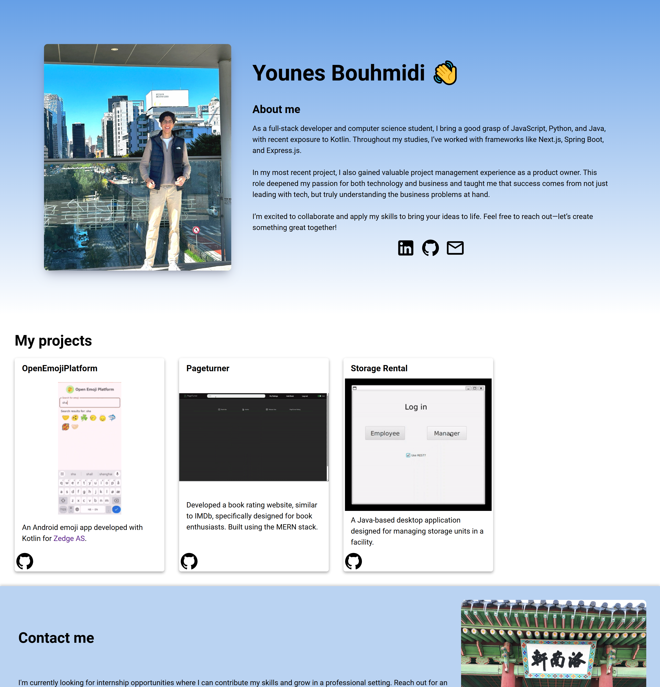
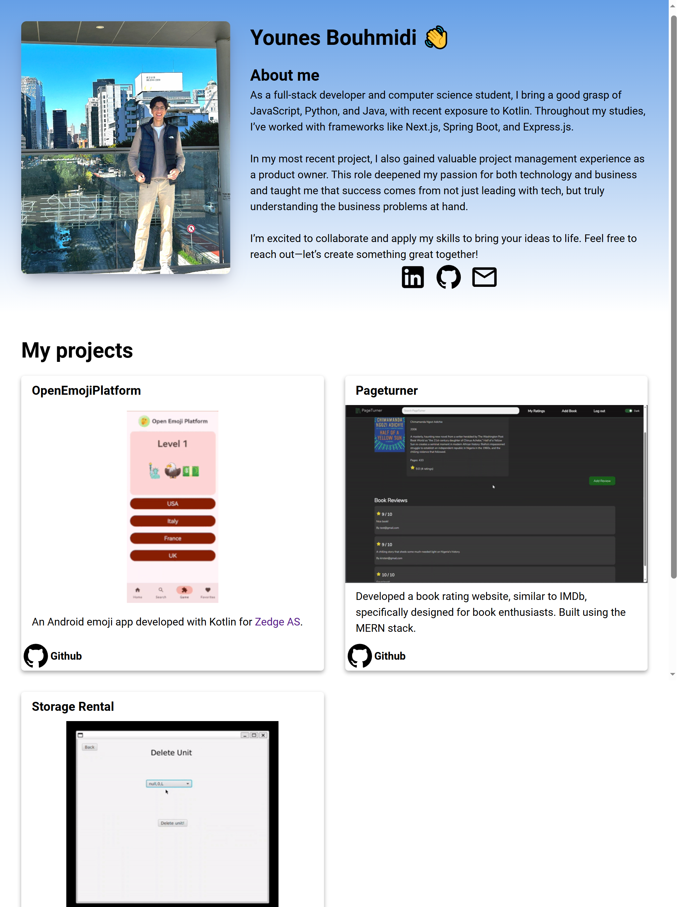

# HomeBase (My homepage)
This website was created to easily showcase some of my projects. Develop a responsive webpage that effortlessly adjusts to various screen sizes.

### Index
|  Desktop (1440x1498)| Mobile (Iphone 14 Pro Max)| Tablet (Ipad Pro)|
|-------------|-----------|-----------|
| |||

## Project Highlights:

* **Responsive Layout:** Utilized CSS Grid to dynamically adjust the number of cards based on screen size.
* **Polished Visuals:** Integrated SVGs for a cleaner, more professional presentation.
* **Interactive Animations:** Applied `@keyframes` to animate titles when hovering over SVG icons.
* **Streamlined Project Management:** Leveraged JavaScript to dynamically generate project cards from an array, simplifying future updates.
* **Smooth User Experience:** Implemented `setTimeout` and `transition` for a gradual display of project cards, ensuring a smooth loading process.

## Challenges Overcome:

* **Smooth Transitions:** Effectively used `transition` to create a seamless fade-in effect for project cards.
* **Adaptive Images:** Employed `<source>` and `<picture>` elements to ensure images adjust based on screen width.
* **Dynamic SVG Handling:** Leveraged `createElementNS` and `setAttributes` to programmatically generate and insert SVG elements using JavaScript.

## Technologies Used:

* HTML
* CSS
* JavaScript